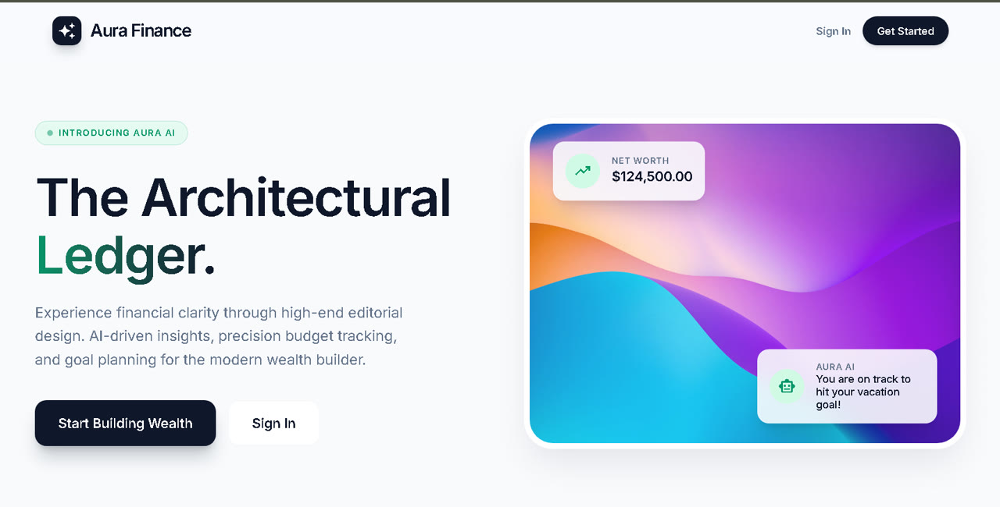
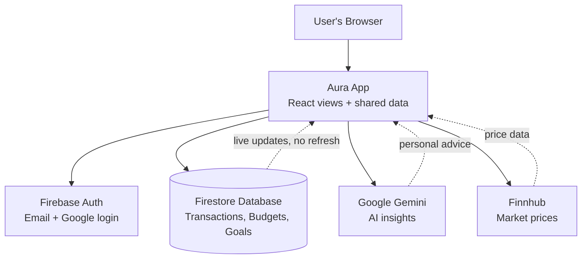
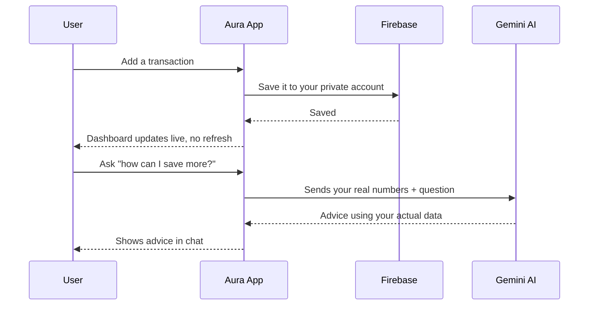

# Aura Finance

### Money doesn't disappear all at once. It disappears quietly.

Most budgeting apps show you what you already spent. Aura Finance shows it, explains it, and tells you what to do next — with an AI that reads your real numbers.

[](https://aura-financ.web.app)


Live Demo: https://aura-financ.web.app

[](assets/demo.mp4)


## The problem

You earn. You spend. And somewhere between the bank app, the card statement, and last month's budget spreadsheet, the numbers stop making sense.

Budgets get set in January and forgotten by February. Savings never grow, and nothing tells you why.

This project fixes exactly that — written for everyone: a recruiter scanning in 15 seconds, a non-technical reader, a fresher learning React, or a developer reviewing the code. No background needed to follow along.

## A day with Aura

**8:00 AM** — you buy coffee, open the app, log it in one tap. It's saved to your own private account.

**Mid-month** — Groceries crosses 80% of its limit. A warning appears *before* you overspend, not after.

**Payday** — salary is added. The dashboard updates by itself. No refresh, no button.

**Evening** — you ask *"can I afford a trip in June?"* The AI answers using your actual balance, budgets, and goals — not generic advice.

Everything in between works the same way: savings goals with progress rings, monthly income and expense charts, search and filters over your history, and a switch between USD, EUR, GBP, INR and JPY that instantly changes every number on screen. Login is email/password or Google, and each person only ever sees their own data.

## How it works underneath

None of that needs a backend server.



And when you add one transaction, here is exactly what happens:



Firebase handles login, the database, and the security rules — so the whole app runs inside the browser with no backend to maintain.

## Why I built it this way

Every technology here was a decision, not a default.

| Decision | Why this one |
|---|---|
| React 19 + TypeScript | Components fit a dashboard; types catch money bugs before the code ever runs |
| Vite 6 | Instant start and fast builds while developing |
| Tailwind CSS v4 | One design system, styled fast and consistently |
| Firebase Auth + Firestore | Login and a cloud database without writing a backend server |
| Google Gemini API | AI that reads your real numbers instead of giving generic tips |
| Finnhub API (optional) | Free market prices — the app falls back to demo data if no key is set |


## Try it yourself

**You need:** [Node.js 18+](https://nodejs.org/) and npm.

1. Clone:
   ```bash
   git clone https://github.com/mohaktalodhikar/aura-finance.git
   ```
2. Install:
   ```bash
   npm install
   ```
3. Create a `.env` file with your keys:
   ```env
   VITE_FIREBASE_API_KEY=your-key
   VITE_FIREBASE_AUTH_DOMAIN=your-project.firebaseapp.com
   VITE_FIREBASE_PROJECT_ID=your-project-id
   VITE_FIREBASE_STORAGE_BUCKET=your-project.appspot.com
   VITE_FIREBASE_MESSAGING_SENDER_ID=your-id
   VITE_FIREBASE_APP_ID=your-id
   VITE_GEMINI_API_KEY=your-gemini-key
   VITE_FINNHUB_API_KEY=your-finnhub-key
   ```
   > Gemini and Finnhub keys are optional — the app works without them.

4. Start:
   ```bash
   npm run dev
   ```
   Then open http://localhost:3000

To get Firebase keys: Firebase Console > Create Project > Enable Auth (Email + Google) + Firestore > Copy web config.

If you open the code, this is all you'll find:

```
src/
  App.tsx          # Login check + page switching
  firebase.ts      # Firebase setup
  context/         # Shared data (transactions, budgets, goals)
  components/      # Sidebar, TopNav, BottomNav
  views/           # Login, Overview, Transactions, Budgets, Insights, Settings
```

## What I'd still change

No project ships perfect, and this one isn't either.

* Store profile pictures in Firebase Storage instead of inside database records.
* Add unit tests for money and budget calculations.
* Use live exchange rates instead of fixed ones for currency switching.
* Add error boundaries and server-side pagination for large amounts of data.

## The person behind it

I built this end to end — interface, data layer, authentication, and the AI integration — while learning how real-time apps and security rules fit together.

**Mohak Talodhikar**

- [LinkedIn](https://www.linkedin.com/in/mohak-talodhikar/)
- [GitHub](https://github.com/mohaktalodhikar)
- [Instagram](https://www.instagram.com/mohak_talodhikar/)
